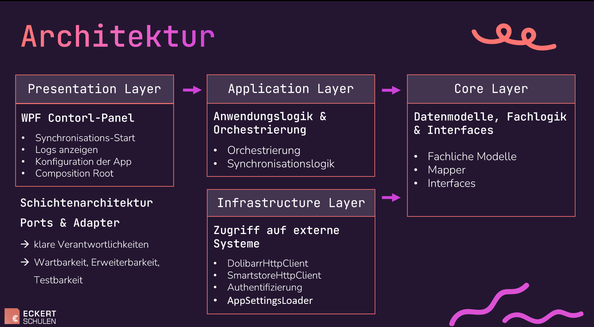
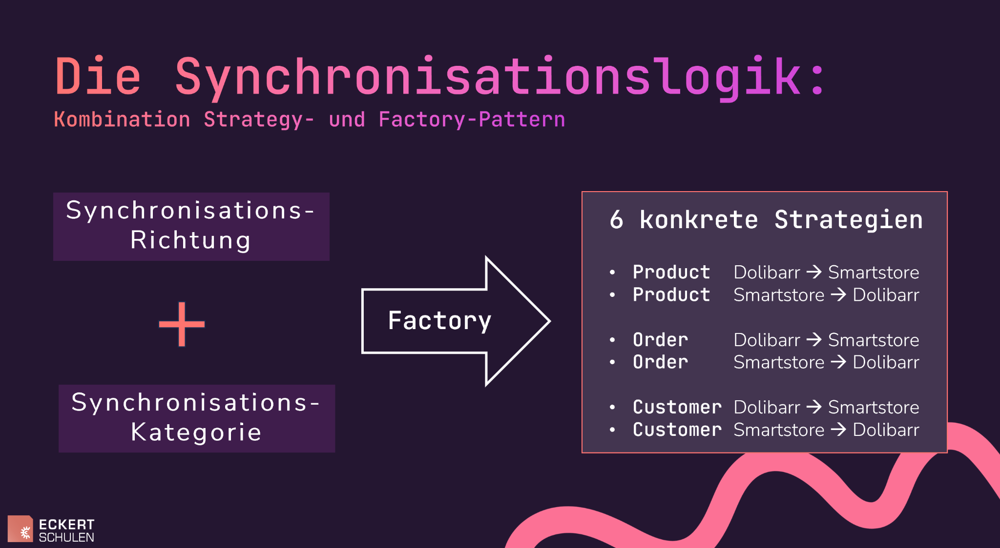
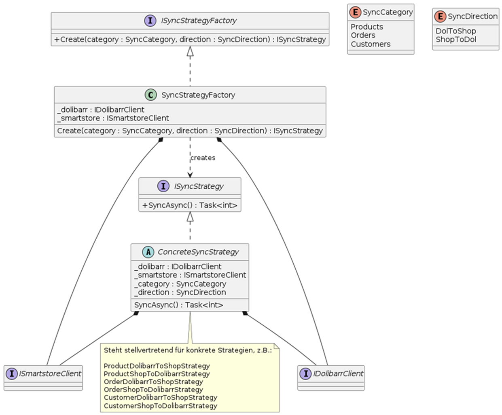

# SyncBridge

> **Work in Progress / Proof of Concept (PoC)**  
> Layered .NET 8 Middleware zur bidirektionalen Synchronisation zwischen **Dolibarr (ERP)** und **Smartstore (Webshop)**.

SyncBridge ist ein Desktop-basiertes Integrationssystem, das Geschäftsdaten automatisiert zwischen zwei realen Produktivsystemen synchronisiert.  
Der Fokus liegt auf sauberer Architektur, erweiterbarer Integrationslogik und kontrollierbarer Synchronisation – nicht auf einem „perfekt polierten“ Demo-Frontend.

---

## Motivation

Zwischen Dolibarr und Smartstore existierte kein Connector zum direkten Datenaustausch. Daten mussten manuell in beide Systeme eingepflegt werden. Dies führte zu inkonsistenten Datenbeständen, hoher Fehleranfälligkeit und ineffizienten Geschäftsprozessen. 

---

## Technischer Kern

SyncBridge implementiert:

- Bidirektionale Synchronisation
- Delta-/Update-Erkennung
- Mapping zwischen unterschiedlichen Datenmodellen
- API-basierte Integration (REST & OData)
- Konfigurationsgetriebene Anbindung
- Transparente Status- und Fehlerausgabe
- Steuerung über eine GUI

---

## Projektstatus

**Aktueller Stand:** Work in Progress / Architektur-Demonstrator

Das Projekt ist öffentlich als Proof of Concept verfügbar, um Architektur, Integrationslogik und Entwicklungsfortschritt transparent zu zeigen.

### Bereits implementiert

- Produkt-Synchronisation in beide Richtungen (inkl. Delta-Logik)
- Kunden-Synchronisation in beide Richtungen (Basis-Mapping & Abgleich)
- Strategy-basierte Sync-Logik je Datentyp und Richtung
- Zentrale Factory zur Laufzeit-Auswahl der Strategie
- WPF-Control-Panel mit Logging
- Konfigurierbare API-Anbindung über `config.json`

### Bekannte Einschränkungen

- Order-Sync ist noch nicht implementiert
- Customer-Sync noch nicht vollständig stabil
- API-Calls werden noch optimiert für bessere Performance
- Testabdeckung wird aktuell erweitert

Diese Punkte sind bewusst offen dokumentiert und Teil der nächsten Iterationen.

---

## Architektur

Das Projekt folgt einer klar getrennten Schichtenstruktur um die Anwendung modular erweiterbar und gut wartbar zu halten.

- `SyncBridge.App` – WPF UI (Control Panel)
- `SyncBridge.ApplicationLayer` – Orchestrierung / Sync-Strategien
- `SyncBridge.Core` – Domain-Modelle, Interfaces, Mapper
- `SyncBridge.Infrastructure` – Technische Anbindung - HTTP-Clients & API-Anbindung

## Architekturüberblick

  

### Architekturprinzipien

- Trennung von Verantwortlichkeiten (Separation of Concerns)
- Arbeiten gegen Interfaces
- Strategy Pattern je Sync-Richtung
- Factory Pattern zur Laufzeitauswahl
- Konfigurationsgetriebene Systemintegration
- Erweiterbarkeit für zusätzliche Systeme oder Datentypen

## Synchronisationslogik (Strategy + Factory)

  

## Klassendiagramm zur Synchronisationslogik

  

---

## Tech Stack

- .NET 8
- WPF
- REST (Dolibarr API)
- OData / HTTP (Smartstore API)
- JSON-basierte Konfiguration
- Dependency Injection
- Git

---

## Voraussetzungen

- Windows (WPF)
- .NET 8 SDK
- Laufende Instanzen von:
  - Dolibarr
  - Smartstore
- API-Zugangsdaten für beide Systeme

---

## Setup

1. Repository klonen  
2. Beispielkonfiguration kopieren:  
   `SyncBridge/config.json.example` → `SyncBridge/config.json`  
3. API-URLs und Keys eintragen  
4. Solution in Visual Studio öffnen (`SyncBridge.sln`)  
5. Projekt starten  

`config.json` ist bewusst in `.gitignore`, um Secrets zu schützen.

---

## Roadmap

- Stabilisierung des Order-Sync
- Erweiterte Validierung im Customer-Flow
- Reduzierung von API-Calls (Batching / Caching)
- Verbesserte Fehlerbehandlung & Observability
- Erweiterte Testabdeckung (Unit & Integration)
- Retry-Mechanismen
- Optionale Umstellung auf Background-Service
- Konfliktmanagement bei parallelen Änderungen

---

## Sicherheitshinweis (TLS / Development Setup)

Für die lokale Docker-Testumgebung von Smartstore wird ein selbstsigniertes Zertifikat verwendet.  
In diesem Kontext wird die TLS-Zertifikatsprüfung im Smartstore-Client für `localhost` explizit deaktiviert, um die Entwicklung zu ermöglichen.

Wichtig:
Dieses Verhalten ist ausschließlich für lokale Entwicklungs- und Testumgebungen vorgesehen und darf nicht in produktiven Umgebungen verwendet werden.

In einem produktiven Szenario muss die Zertifikatsprüfung aktiviert bleiben und durch ein vertrauenswürdiges Zertifikat ersetzt werden.

---

## Für Recruiter / Hiring Teams

Dieses Repository zeigt bewusst einen realistischen Entwicklungsstand.

Demonstriert werden:

- Strukturierte .NET-Architektur
- Mehrschichtige Systemtrennung
- Einsatz von Strategy- und Factory-Pattern
- Integration externer APIs
- Mapping zwischen unterschiedlichen Domänenmodellen
- Konfigurations- und Sicherheitsbewusstsein
- Iterative Weiterentwicklung mit transparenter Roadmap

Der Fokus liegt auf Engineering-Qualität und Integrationsarchitektur – nicht auf einem UI-Demo-Projekt.

---

## Lizenz

Derzeit ist noch keine Lizenz hinterlegt.  
Bei Wiederverwendung sollte eine geeignete Lizenz (z. B. MIT) ergänzt werden.
